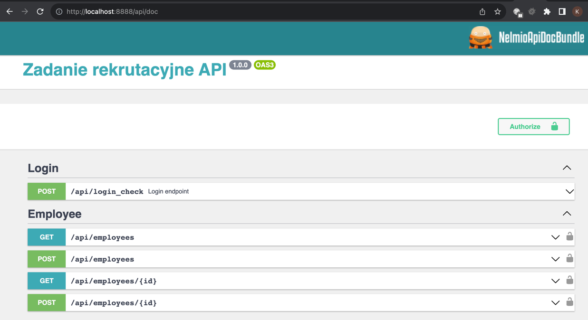

# zadanie_rekrutacyjne_08_2023

W celu uruchomienia projektu należy użyć polecenie:  
**docker compose up -d**

Następnie za pomocą IDE lub polecenia w terminalu, należy wejść do konteneru, gdzie znajduje się obraz PHP  
**docker exec -it zadanie_rekrutacyjne_08_2023-php-fpm-1 /bin/bash**

Teraz należy wykonać szereg komend: 

1. composer install
2. php bin/console doctrine:database:drop --force || true
3. php bin/console doctrine:database:create
4. php bin/console doctrine:migrations:migrate -n
5. php bin/console doctrine:fixtures:load -n
6. php bin/console lexik:jwt:generate-keypair --overwrite -n

W celu sprawdzenia poprawności działania systemu należy również uruchomić testy
7. php bin/phpunit

Dokumentacja API znajduje się po adresem: 

**http://localhost:8888/api/doc**

Przykładowe dane do autoryzacji API (Wygenerowane za pomocą fixtures) 
**Login: test@test.pl** 
**Hasło: zaq1@WSX**

